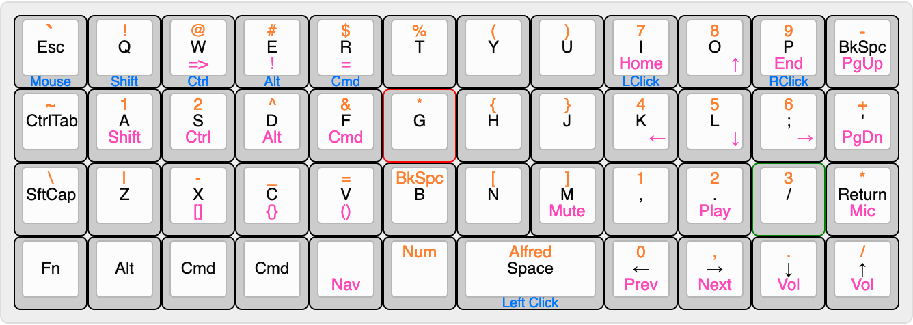

# Losandes Ambi Planck Layout

This layout is designed to be fairly similar to a standard qwerty layout for the primary layer, but with substantial differences to other layers. Most noteably, the numbers are in a numpad layout, and the special characters are mostly shifted to the left hand, with some exceptions.

#### Notes

Keyboard Layout Editor: http://www.keyboard-layout-editor.com
Keyboard Layout Editor Data Model: Structure: https://github.com/ijprest/keyboard-layout-editor/wiki/Serialized-Data-Format